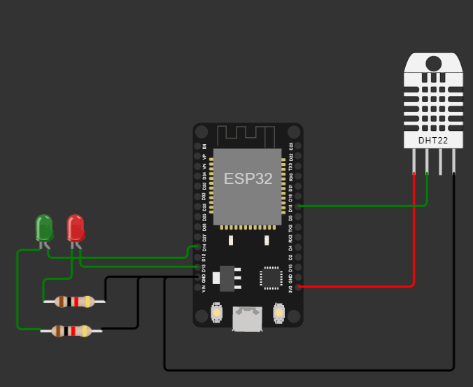
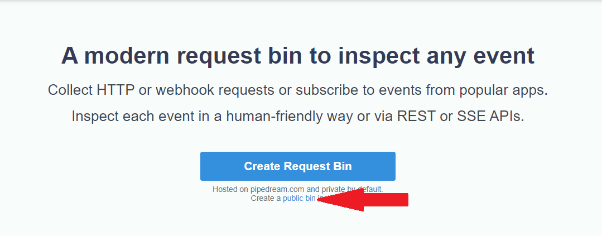
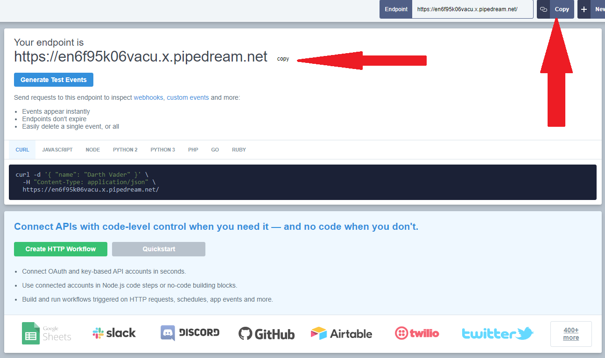

# Mini Curso ESP32
Material apresentado no minicurso de esp32 na 28ª e 29º semana da computação.

## Simulador
O simulador utilizado se encontra no link:
https://wokwi.com/projects/new/esp32

Ao abrir o link, será aberto um espaço de trabalho com apenas uma ESP32. Utilize o botão com o símbolo "+" no canto superior esquerdo da área da ESP32 para adicionar 2 leds e um DHT22. Segue na imagem abaixo o circuito sugerido para o código deste repositório.

Após a contrução do código, basta copiar e colar o código encontrado no arquivo `SensorDeTemperatura.c` no espaço para código do simulador.

Antes de executar o código, é necessário trocar o link destino na variável `urlpost`, caso não possua um servidor criado para receber esse dado, também poderá ser usado uma instância no `RequestBin.com`.

As credenciais de rede não podem ser alteradas, pois o WiFi é simulado e segundo a documentação do WokWi, as credenciais padrão são as que já se encontram no código, caso deseje rodar esse código em uma placa física, as credenciais precisam ser alteradas para corresponder a rede desejada.

## RequestBin

Caso não possua um servidor com uma API sendo executada para receber os dados do sensor, é possível criar um para simulação gratuito e sem autenticação no site https://requestbin.com, basta abrir o site e clicar na opção "public bin", conforme mostrado na imagem abaixo. 

Após a criação, copie o link disponibilizado no canto superior direito e cole na variável `urlpost` no código.

Mas não é aconselhado utilizar com dados reais e sensíveis, pois quando criado de forma pública, qualquer pessoa com o lik poderá acessar e enviar ou obter os dados na API.
